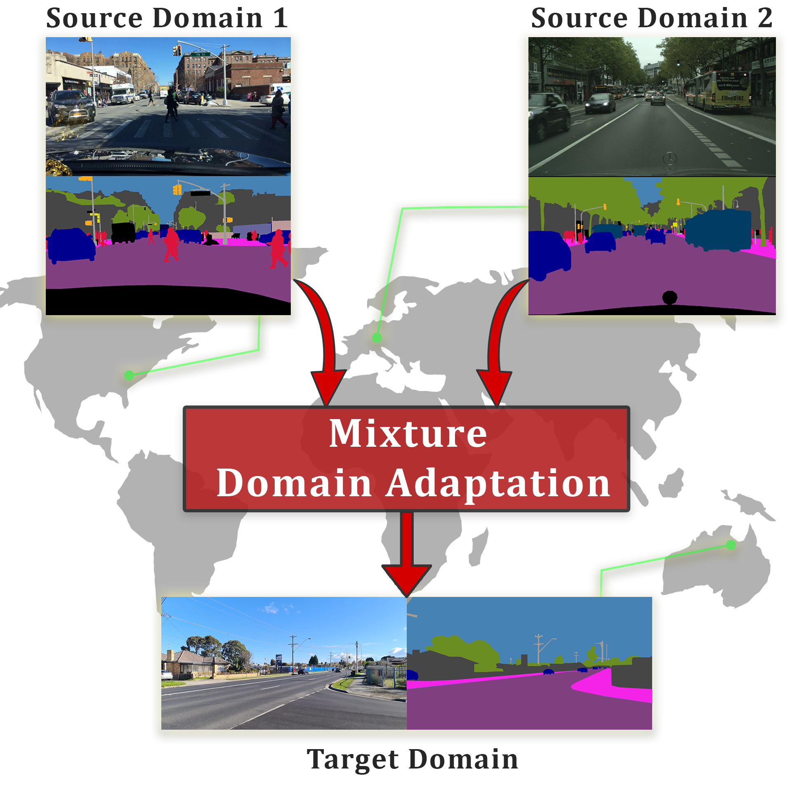

# Mixture Domain Adaptation to Improve Semantic Segmentation in Real-World Surveillance

<p align="center"></p>

This repository contains the official implementation of the following paper: "Mixture Domain Adaptation to Improve Semantic Segmentation in Real-World Surveillance", which is presented at WACV 2023.  


## bibtex
```
@inproceedings{Pierard2023Mixture,
    author    = {Pi\'erard, S\'ebastien and Cioppa, Anthony and Halin, Ana{\"\i}s and Vandeghen, Renaud and Zanella, Maxime and Macq, Beno{\^\i}t and Mahmoudi, Sa{\"\i}d and Van Droogenbroeck, Marc},
    title     = {Mixture Domain Adaptation To Improve Semantic Segmentation in Real-World Surveillance},
    booktitle = {Proceedings of the IEEE/CVF Winter Conference on Applications of Computer Vision (WACV) Workshops},
    month     = {January},
    year      = {2023},
    pages     = {22-31}
}
```

## Requirements
```
matplotlib==3.2.2
natsort==8.2.0
numpy==1.18.5
Pillow==9.3.0
PyYAML==6.0
scikit_learn==1.2.0
torch==1.10.0
torchvision==0.11.1
tqdm==4.47.0
```

## Data

You must acquire the data by your side. To use our splits, you can use the code `preprocessing/split.py`.   
The data structure needed is as follow:

```
datasets/
├── Driving
│   ├── BDD100K
│   │   ├── prior.txt
│   │   ├── test
│   │   ├── train
│   │   └── val
│   ├── CityScapes
│   │   ├── prior.txt
│   │   ├── test
│   │   ├── train
│   │   └── val
└── Surveillance
    ├── Drone
    │   ├── prior.txt
    │   ├── test
    │   ├── train
    │   └── val
    ├── M-30-HD
    │   ├── prior.txt
    │   ├── test
    │   ├── train
    │   └── val
    ├── RainSnow
    │   ├── prior.txt
    │   ├── test
    │   ├── train
    │   └── val
    └── Sherbrooke
        ├── prior.txt
        ├── test
        ├── train
        └── val
```

and each `train`, `val` and `test` folder contains 2 subfolders: `images` and `targets`.
    
## Usage

The code can be used to train a [discriminator model](#discriminator), a [source model](#source-model) and to [combine](#combination) the posteriors of different source models.

Config files for the Driving and Surveillance datasets are provided in the `src/configs` folder.

### Discriminator
Train a discriminator:
```
python main.py --path path_to_datasets
               --config_file datasets_config.yaml
               --train_discriminator
               --save_name discriminator_name
```
### Source model
Train a source model:
```
python main.py --path path_to_datasets
               --config_file datasets_config.yaml
               --train_source_model
               --save_name source_model_name
               --lambdas list_of_lambdas  # lenght==number of datasets, sum of lambdas must equal 1
```
### Combination
Combine decisions:
```
python main.py --path path_to_datasets
               --config_file datasets_config.yaml
               --combine
               --combination_name combination_to_test # None, naive, posteriors or ours
               --discriminator discriminator_name
               --source_models list_of_source_model_names # lenght==number of datasets
               --lambdas list_of_lambdas  # lenght==number of datasets, sum of lambdas must equal 1
               --batch_size 1
```

## Authors
* **Sébastien Piérard**, University of Liège,
* **Anthony Cioppa**, University of Liège,
* **Anaïs Halin**, University of Liège,
* **Renaud Vandeghen**, University of Liège,
* **Maxime Zanella**, University of Louvain-la-Neuve.
